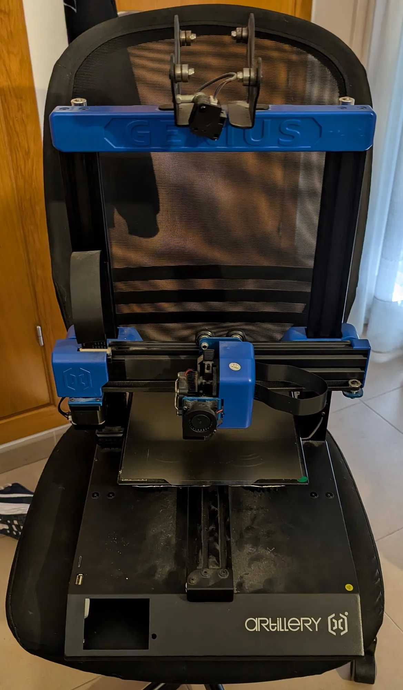
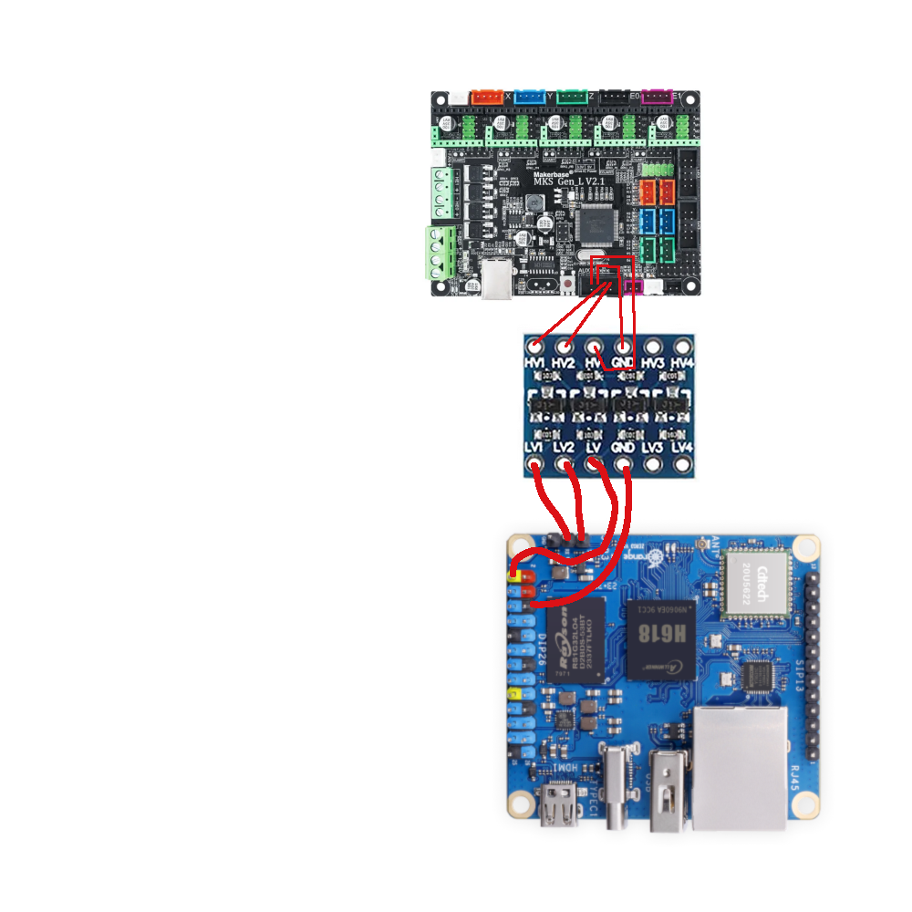

# Artillery Genius Klipper

This is a mod for the Artillery Genius 3D printer, which adds Klipper firmware support. It uses an Orange Pi Zero 3 as the host controller.

## Images

## Features

- Klipper firmware support
- up to 50% reduction in print times
- Improved print quality
- Remote monitoring and control via web interface (Fluidd/Mainsail)

## Wiring Diagram

## License

This work is licensed under a
[Creative Commons Attribution-NonCommercial 4.0 International License][cc-by-nc].

[![CC BY-NC 4.0][cc-by-nc-image]][cc-by-nc]

[cc-by-nc]: https://creativecommons.org/licenses/by-nc/4.0/
[cc-by-nc-image]: https://licensebuttons.net/l/by-nc/4.0/88x31.png
[cc-by-nc-shield]: https://img.shields.io/badge/License-CC%20BY--NC%204.0-lightgrey.svg

